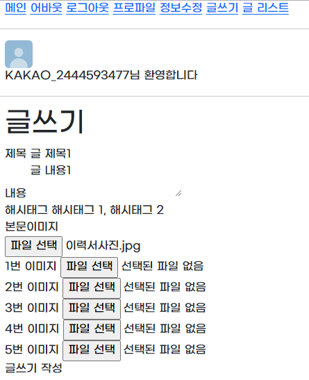
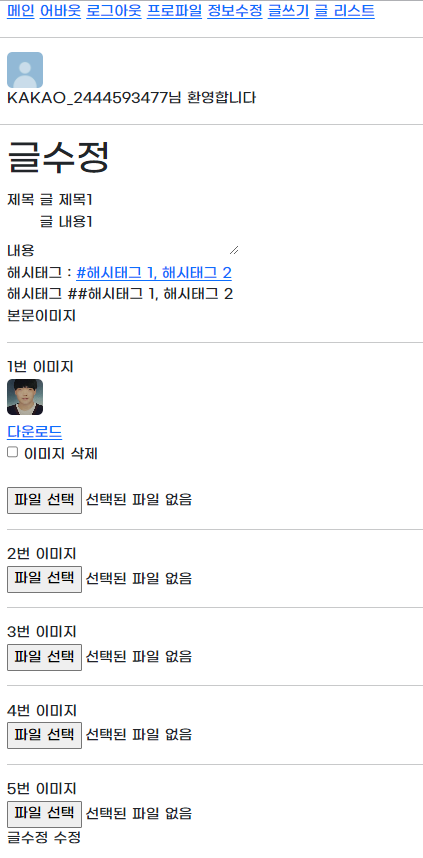

## 스프링 파일업로드
### 기능 요약
- 사진을 업로드하는 기능을 중심으로 스프링부트를 활용한 간단한 CRUD 게시판  

### 사용 기술
- 카카오 소셜 로그인
- 카카오 프로필 사진, 닉네임, 이메일 사용
- 프로필 사진 변경 
- 게시글 작성 시 여러 장의 사진을 업로드 가능
- 지정한 경로(genFileDirPath) 폴더에 날짜 별 사진을 저장

### 결과물
- 카카오 로그인

- 메인 화면

- 게시글 작성

- 게시글 상세

- 게시글 수정

- 게시글 리스트

