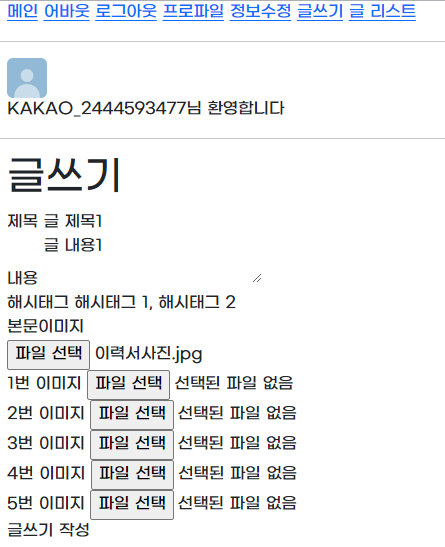
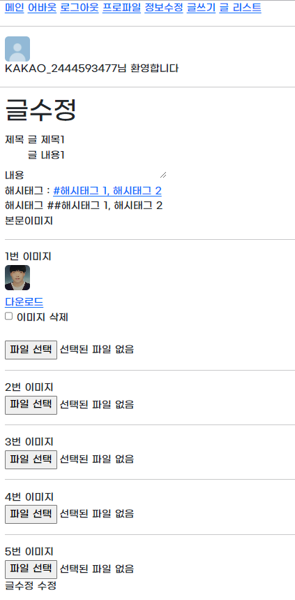

## 스프링 파일업로드
### 기능 요약
- 소셜 로그인을 통해 해당 사이트에 로그인하고 사진을 업로드하는 기능을 중심으로 스프링부트를 활용한 간단한 CRUD 게시판을 제공한다. 

### 사용 기술
- Spring Security
- 카카오 소셜 로그인
- 카카오 프로필 사진, 닉네임, 이메일 사용
- 프로필 사진 변경 
- 게시글 작성 시 여러 장의 사진을 업로드 가능
- 지정한 경로(genFileDirPath) 폴더에 날짜 별 사진을 저장

### 느낀 점
- oauth2를 통해 엑세스토큰을 얻고 이를 Resource Server에 사용자 정보를 요청하여 userRequest로 받아 프로필을 저장하였다. 이를 처음부터 이해하는 과정에 있어 관련 문서나 영상을 찾아보면서 엑세스 토큰을 얻는 과정에 대해 깊이 있게 학습하고 실습해보았다.
  
- 일반적인 게시글과 달리 사진을 여러장 업로드하고 이를 어떻게 관리할 것인지 고민해보고 날짜 별로 사진을 관리하고 파일 처리 관련 함수들을 사용해보았다. 아직 익숙하지 않아 어려움이 있지만 비슷한 프로젝트 진행 시에 이번에 작성한 코드를 사용할 수 있도록 기능을 최대한 분리하면서 작성해보았다. 

### 결과물
- 카카오 로그인

- 메인 화면

- 게시글 작성

- 게시글 상세

- 게시글 수정

- 게시글 리스트

